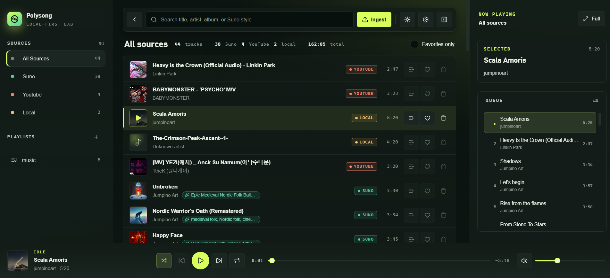
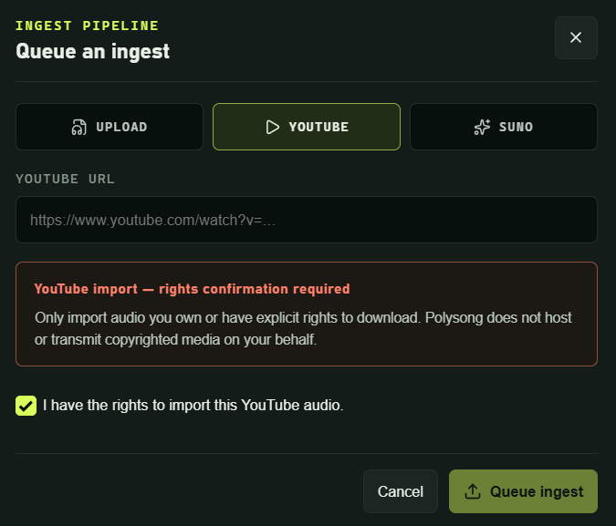
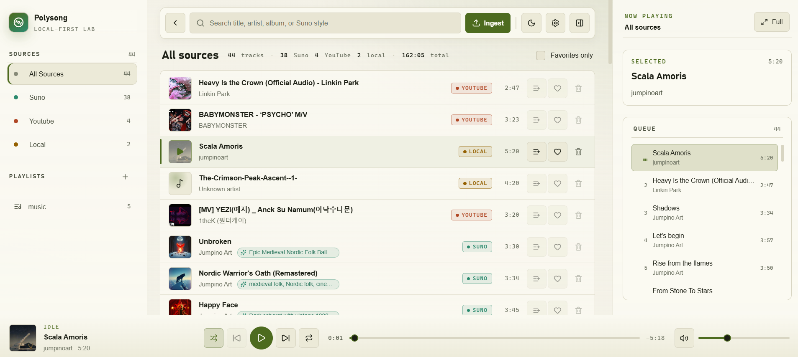

# Polysong

Polysong is a local-first music library for songs you own or have the right to keep locally. It can organize local audio files, your Suno generations, and YouTube audio you are allowed to download.

Everything stays on your machine. Songs, covers, and the SQLite database are stored locally.

Support the creator for more content: revolut.me/jumpino

## What It Does

- Import songs from local files, Suno, or YouTube.
- Store audio in source folders: `songs/local`, `songs/suno`, and `songs/youtube`.
- Store cover images in `songs/covers`.
- Keep the library database in `polysong.db`.
- Play tracks with queue, seek bar, volume, shuffle, repeat, and fullscreen visualizers.
- Use playlists without copying songs. A song can be in many playlists while the file stays in its source folder.

## Screenshots

| Library | Ingest |
| --- | --- |
|  |  |

| Player | Fullscreen |
| --- | --- |
|  |  |

## Install On Windows

The easiest way to use Polysong on Windows is the installer:

```bat
installer_windows.bat
```

This builds:

```text
dist/installed.exe
```

If you downloaded GitHub's `Source code (zip)` for a release, this script downloads that release's prebuilt Windows installer into `dist/installed.exe`. In a git checkout, it builds the installer locally.

The installed Windows app checks GitHub releases on startup. If `https://github.com/jumpino27/Polysong` has a newer latest release than the running app version, Polysong shows an Update button in the app. Pressing it downloads that release's `installed.exe`, launches it, and exits so the installer can install the new version. This updates the app and any installer-managed bundled technologies, including helper tools such as `yt-dlp`, `ffmpeg`, and `ffprobe`.

If you are editing the installer locally or making a custom build and do not want the installed app to update itself from this repo's GitHub releases, open `installer_windows.bat` and delete or empty this value near the top before building:

```bat
set "GITHUB_REPO=jumpino27/Polysong"
```

For example:

```bat
set "GITHUB_REPO="
```

With that value empty, the built app skips the GitHub release updater and only uses your local build.

Run `dist/installed.exe` to install Polysong.

The installer lets you choose the install directory. After installation, Polysong keeps its data beside the installed app:

```text
Polysong/
  polysong-app.exe
  polysong.db
  songs/
    local/
    suno/
    youtube/
    covers/
```

If you install to the default Windows user location, this is usually:

```text
C:\Users\<you>\AppData\Local\Polysong
```

The Windows installer also bundles the helper tools Polysong needs for imports:

- `yt-dlp.exe` for YouTube imports
- LGPL `ffmpeg.exe` and `ffprobe.exe` for local-file metadata and cover extraction

They are installed into:

```text
Polysong/
  tools/
    yt-dlp.exe
    ffmpeg.exe
    ffprobe.exe
```

Polysong uses these bundled tools first, then falls back to tools on `PATH` if needed.

The installer, installed Windows app, and `start_no_exe.bat` keep a small manifest beside the bundled helper tools. On startup/build they compare the manifest with GitHub's current `yt-dlp.exe` and FFmpeg LGPL release assets, then refresh the local `tools/` copies when upstream changed or files are missing. To force a helper refresh without changing the recipe, run:

```bat
set POLYSONG_REFRESH_INSTALLER_TOOLS=1
installer_windows.bat
```

For an installed app, set `POLYSONG_DISABLE_TOOL_UPDATER=1` before launch to skip helper-tool update checks.

### Code Signing

`installer_windows.bat` supports Authenticode signing if you provide a trusted code-signing certificate:

```bat
set POLYSONG_SIGN_CERT_PATH=C:\path\to\certificate.pfx
set POLYSONG_SIGN_CERT_PASSWORD=your-password
installer_windows.bat
```

Or with a certificate already installed in the Windows certificate store:

```bat
set POLYSONG_SIGN_CERT_THUMBPRINT=YOUR_CERT_THUMBPRINT
installer_windows.bat
```

Without a trusted certificate, the installer is built unsigned and Windows SmartScreen may warn users.

## Run From The Codebase

Use these scripts when you want to run Polysong locally from the source code instead of installing it.

Source-run scripts update from git before starting. `start_no_exe.bat`, `start_no_exe.sh`, and `first_setup_no_exe.sh` run `git pull --ff-only` in a git checkout when there are no local tracked edits. The installed app does not use git; it updates only from GitHub releases.

### Windows

First setup:

```bat
first_setup_no_exe.bat
```

Start the local backend and browser frontend:

```bat
start_no_exe.bat
```

No-exe mode uses this project folder as its data directory and runs its backend on `http://127.0.0.1:4778`, so it does not mix with the installed app.

### Linux And macOS

First setup:

```sh
./first_setup_no_exe.sh
```

Start the local backend and browser frontend:

```sh
./start_no_exe.sh
```

These scripts are only for local development/testing. They do not build an installer.

The installed Windows app keeps its own database and songs beside the installed executable. The source-code scripts keep their database and songs inside this repository folder.

## What The Scripts Do

| Script | Platform | What it does |
| --- | --- | --- |
| `first_setup_no_exe.bat` | Windows | Installs/checks local project tools, installs frontend dependencies, checks Rust/Cargo, downloads media helpers, builds what is needed, and creates `start_no_exe.bat`. |
| `start_no_exe.bat` | Windows | Starts the Rust backend and the browser frontend for local source-code use. |
| `first_setup_no_exe.sh` | Linux/macOS | Same idea as the Windows setup script, but for Unix-like systems. It also downloads local `yt-dlp`, `ffmpeg`, and `ffprobe` tools. |
| `start_no_exe.sh` | Linux/macOS | Starts the local backend and browser frontend. |
| `installer_windows.bat` | Windows | Builds the Windows installer, embeds the GitHub release updater target, refreshes installer-managed helper tools when their recipe changes, and writes the installer to `dist/installed.exe`. |

## Developer Commands

If you prefer package commands:

| Command | What it does |
| --- | --- |
| `pnpm install` | Install frontend dependencies. |
| `pnpm dev` | Run backend and frontend together for browser development. |
| `pnpm dev:frontend` | Run only the Vite frontend. |
| `pnpm dev:backend` | Run only the Rust backend on `127.0.0.1:4777`. |
| `pnpm build` | Build the frontend. |
| `pnpm tauri:dev` | Run the Tauri desktop app in development mode. |
| `pnpm tauri:build` | Build the Tauri app. |
| `pnpm check:rust` | Run `cargo check --workspace`. |

## Requirements

The setup scripts keep the app's tooling local to this project where possible. They create ignored `.dev/` and `tools/` folders for downloaded compilers, package tools, and media helpers.

If you install things manually for development, you need:

- Node.js and pnpm
- Rust and Cargo
- `yt-dlp` for YouTube imports
- `ffmpeg` and `ffprobe` for local-file metadata and cover extraction

## Privacy And Rights

Polysong is for content you own or have permission to keep locally.

- Local files are copied from files you choose.
- Suno imports are intended for your own generations.
- YouTube imports require you to confirm you have the right to download the audio.

Polysong does not upload your songs or host media for other people. It is a local downloader, local organizer, and local player.

## License

MIT. See [LICENSE](LICENSE).
